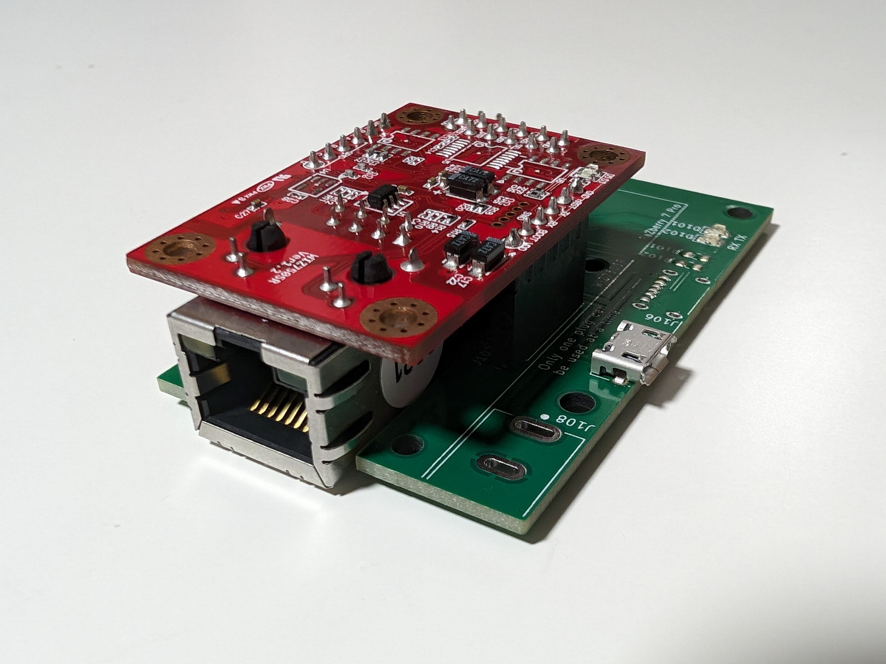
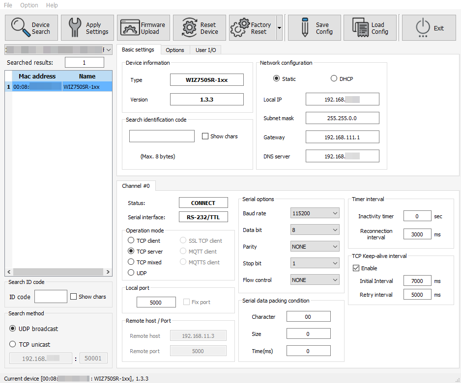
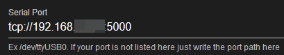

# Raspberry Pi UART to Ethernet Adapter 

<!-- ABOUT THE PROJECT -->
## About The Project
This adapter board enables the creation of a stand-alone, network-compatible device using any Raspberry Pi compatible UART daughterboard. The adapter board is used to connect the daughterboard of the Raspberry Pi and [WIZ750SR](https://docs.wiznet.io/Product/S2E-Module/WIZ750SR)-TTL. The adapter board connects the daughterboard of the Raspberry Pi to the [WIZ750SR](https://docs.wiznet.io/Product/S2E-Module/WIZ750SR)-TTL. It also provides a 5V and 3.3V power supply where necessary.

The adapter board was initially designed to connect the [RaZberry 7 Pro](https://z-wave.me/products/razberry/#slide-1) to [Home Assistant](https://www.home-assistant.io/) via TCP, without using a Raspberry Pi as a server. It can also be used with any Raspberry Pi daughterboard that only needs the TTL-UART interface. However, the following README refers to the use of the [RaZberry 7 Pro](https://z-wave.me/products/razberry/#slide-1) with [Home Assistant](https://www.home-assistant.io/). It is possible to map three GPIOs to the header, although this has not been tested yet.

The board or as a kit (incl. [WIZ750SR](https://docs.wiznet.io/Product/S2E-Module/WIZ750SR)) can be purchased here. The board is available with three power supply options (power supply not inlcuded):
* [Barrel Jack 2.1x5.5 mm](https://www.digikey.com/en/products/detail/cui-devices/PJ-037A/1644545)
* USB Micro
* USB C

(<a href="https://github.com/nikolai2111/RaspberryPi-UART_Ethernet_Adapter#About The Project">back to top</a>)

### Built With
* [KiCAD 8.0](https://www.kicad.org/)

(<a href="https://github.com/nikolai2111/RaspberryPi-UART_Ethernet_Adapter#About The Project">back to top</a>)

<!-- GETTING STARTED -->
## Getting Started
### Prerequisites
* [Home Assistant](https://www.home-assistant.io/) is running
* [Z-Wave JS UI](https://www.home-assistant.io/integrations/zwave_js/) installed
* [WIZnet-S2E-Tool-GUI](https://github.com/Wiznet/WIZnet-S2E-Tool-GUI) downloaded

### Configure WIZ750SR
1. Open the [WIZnet-S2E-Tool-GUI](https://github.com/Wiznet/WIZnet-S2E-Tool-GUI)
2. Click `Device Search`
3. Select device with double click
4. Set the `Basic Settings` as shown in the picture below
   

### Confgure Z-Wave JS UI
1. Open [Home Assistant](homeassistant.local)
2. Open `Add-ons`
3. Click on `Z-Wave JS UI`
4. Start the add-on, if it's not running yet
5. Click on `OPEN WEB UI`
6. Go to `Settings`
7. Go to `Z-Wave`
8. And enter the IP and port below the `Serial Port` as shown in the picture blow. Use the scheme `tcp://your-ip:port`

(<a href="https://github.com/nikolai2111/RaspberryPi-UART_Ethernet_Adapter#About The Project">back to top</a>)

<!-- USAGE EXAMPLES -->
## Usage
Add, remove and rename devices like in Home Assistant and use the enteties like others in Home Assistant.

Alternative other TTL-UART devices could be connected to the Raspberry Pi UART to Ethernet Adapter and used from remote.

(<a href="https://github.com/nikolai2111/RaspberryPi-UART_Ethernet_Adapter#About The Project">back to top</a>)

<!-- ROADMAP -->
## Roadmap
* Test more than one device
* Offer [WIZ750SR](https://docs.wiznet.io/Product/S2E-Module/WIZ750SR) in the shop
* Offer PoE adapter in the shop

See the [open issues](https://github.com/github_username/repo_name/issues) for a full list of proposed features (and known issues).

(<a href="https://github.com/nikolai2111/RaspberryPi-UART_Ethernet_Adapter#About The Project">back to top</a>)

<!-- CONTRIBUTING -->
## Contributing

Contributions are what make the open source community such an amazing place to learn, inspire, and create. Any contributions you make are **greatly appreciated**.

If you have a suggestion that would make this better, please fork the repo and create a pull request. You can also simply open an issue with the tag "enhancement".
Don't forget to give the project a star! Thanks again!

1. Fork the Project
2. Create your Feature Branch (`git checkout -b feature/AmazingFeature`)
3. Commit your Changes (`git commit -m 'Add some AmazingFeature'`)
4. Push to the Branch (`git push origin feature/AmazingFeature`)
5. Open a Pull Request

(<a href="https://github.com/nikolai2111/RaspberryPi-UART_Ethernet_Adapter#About The Project">back to top</a>)

<!-- LICENSE -->
## License

Distributed under the [CERN-OHL-P](LICENSE) License. See `LICENSE` for more information. The license for all other sources remains the same and is still valid.

(<a href="https://github.com/nikolai2111/RaspberryPi-UART_Ethernet_Adapter#About The Project">back to top</a>)

<!-- CONTACT -->
## Contact

Nikolai Zoller - [nikolai.zoller@hotmail.com](mailto:nikolai.zoller@hotmail.com)

Project Link: [https://github.com/nikolai2111/RaspberryPi-UART_Ethernet_Adapter](https://github.com/nikolai2111/RaspberryPi-UART_Ethernet_Adapter)

(<a href="https://github.com/nikolai2111/RaspberryPi-UART_Ethernet_Adapter#About The Project">back to top</a>)

<!-- ACKNOWLEDGMENTS -->
## Acknowledgments
The main concept was initially proposed by an anonymous colleague. The development, production, and sale are carried out with their consent.

(<a href="https://github.com/nikolai2111/RaspberryPi-UART_Ethernet_Adapter#About The Project">back to top</a>)
